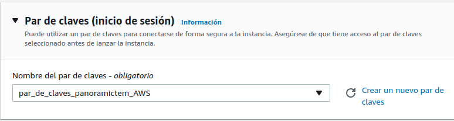
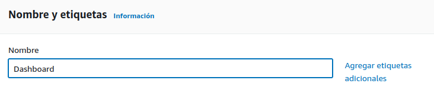
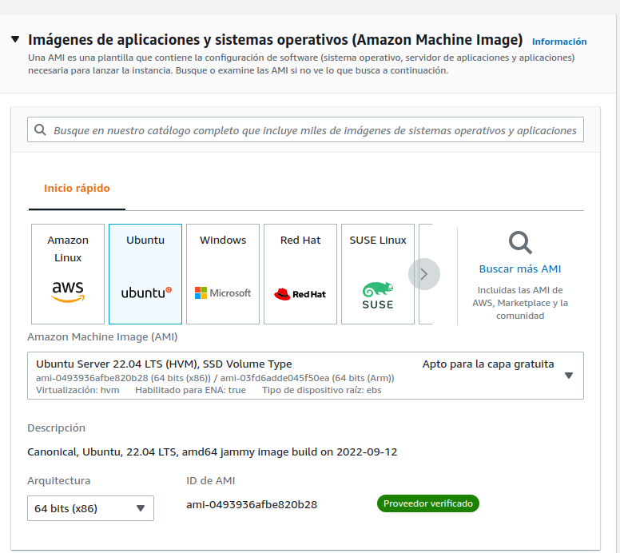
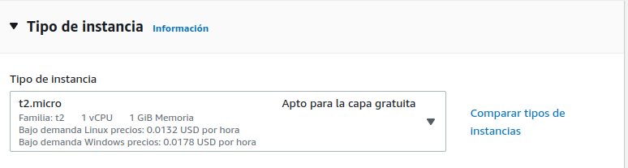
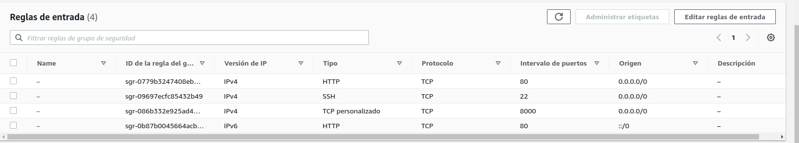
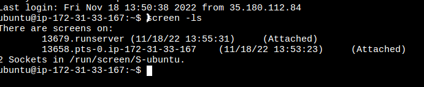

## Operativa

* Generar carpeta
* Generar entorno virtual
* Instalar Django y requirements.txt
* Run  "python manage.py runserver"

## Contraseña administrador

* Usuario: admin
* Contraseña: pass12345

## Subir a Gitlab

##########################################
##########################################

# AWS

* Entramos en AWS de OscarRojo Martín
  usuario: zumaia@uoc.edu

### Crear par de claves

  * Inicie sesión en la AWS Management Console y abra la consola de Amazon EC2 en https://console.aws.amazon.com/ec2/.
  * Elija una región (por ejemplo, US West (Oregon)). Debe ser la misma región en la que se encuentra la tabla de DynamoDB.
  * En el panel de navegación, seleccione Key Pairs (Pares de claves).
  * Seleccione Create Key Pair.
  * En Key pair name, escriba un nombre para el par de claves (por ejemplo, mykeypair) y después elija Create.
  
  
  * Descargue el archivo de clave privada. El nombre de archivo terminará con .pem (por ejemplo, mykeypair.pem). Mantenga este archivo de clave privada en un lugar seguro. Lo necesitará para acceder a cualquier clúster de Amazon EMR que lance con este par de claves.

### Crear instancia

  * Lanzar instancia
    * Indicamos nombre
  
  * Seleccionar Imagen y/o SO... en este caso UBUNTU
  
  * Indicar tipo instancia
  
  * Indicar el par de claves
  * El resto sin modificación.. salvo que tengamos un grupo de seguridad ya existente.
  * Botón "Lanzar instancia"

### Configuración seguridad
    * Reglas de entrada
    * 
  
    * Reglas de salida 
      * - Las estandard

### Conectar instancia
    * Boton conectar
    * Importamos 

### Configuración inicial

    * Tras conectar... sudo apt-get update
    * clonar el repositorio
    * git clone https://gitlab.com/orojo1/panoramic_dash.git
    * Acceder a la carpeta del repositorio clonado
    * Generar entorno virtuarl
      * python3 -m venv my_venv
    * Activamos venv 
      * source my_venv/bin/activate
    * Instalar y actualizar librerias
      * pip install whell
      * pip install --upgrade pip
    * Instalar los requerimientos
      * pip install -r requirements.txt

## Ejecutar el programa

        Utilizamos ScreenRC para trabajar con varios entornos
            *Generamos el que utilizaremos para ejecutar el programa
                screen -S runserver

### Screen session

        Close a session:
            $ screen -XS <session-id> quit
        Change sessión
            $ screen -r <session-id>
        Change session name
            $ screen -X <session-id> <nombre>

            * Con screen -ls, vemos los que están activos

 

            * Se crea uno nuevo comenzamos con la ejecución del programa
                python manage.py runserver 0.0.0.0:8000

        
        En el navegador:
            http://13.38.218.134:8000/

## Contraseña administrador

  * Usuario: admin
  * Contraseña: pass12345
  
  
## Contraseña invitado

  * Usuario: invitado
  * Contraseña: 12345invict
